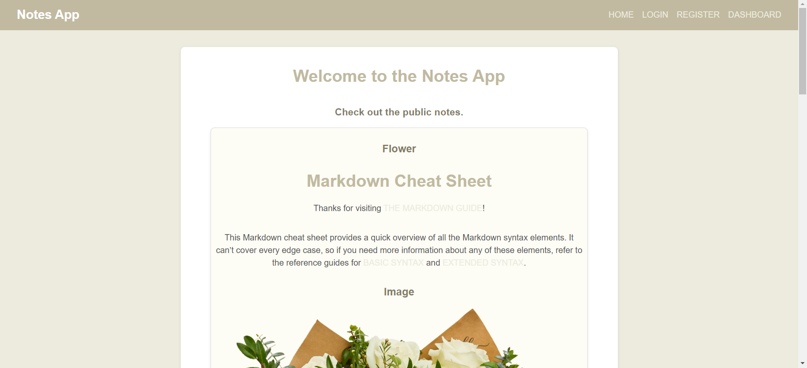
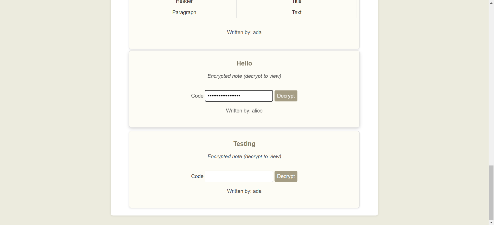

# SafeNotes

A secure note-taking web application built with Flask that emphasizes privacy and security. Features include end-to-end encryption, two-factor authentication, note sharing, and digital signatures.
The application is deployed in a production-ready configuration using uWSGI and Nginx as reverse proxy.

### Tech Stack
- Backend: Flask
- Database: SQLite
- Frontend: HTML/CSS
- Server: Nginx + uWSGI
- Containerization: Docker

## Features

- **Web Security** 
  - HTTPS/TLS support
  - XSS protection
  - SQL injection protection
  - CSRF protection
  - Content Security Policy
  - Rate limiting
  - Secure headers

- **User Authentication & Security**
  - Two-factor authentication (TOTP)
  - Password strength requirements
  - Brute force protection with rate limiting
  - Session management
  - Login history tracking

- **Note Management**
  - Create private, public and shared with chosen users notes
  - Markdown support with safe HTML rendering
  - End-to-end encryption for sensitive notes
  - RSA signatures for author verification
  - AES-GCM encryption

## Preview

##### Public notes


##### Encrypted notes



## Running the app

1. Clone the repository:
```bash
git clone https://github.com/adriannazwierzchowska/safeNotes.git
cd safenotes
```

2. Create the `.env` file with generated aes keys. You can configure it with your own secret keys and email address.
```bash
python generate_env.py
```

3. Generate your own self-signed SSL certificates:
```bash
openssl req -x509 -nodes -days 365 -newkey rsa:2048 -keyout docker/nginx/safenotes.key -out docker/nginx/safenotes.crt
```

4. Build and run with Docker Compose:
```bash
docker-compose up
```

The application will be available at `https://localhost`